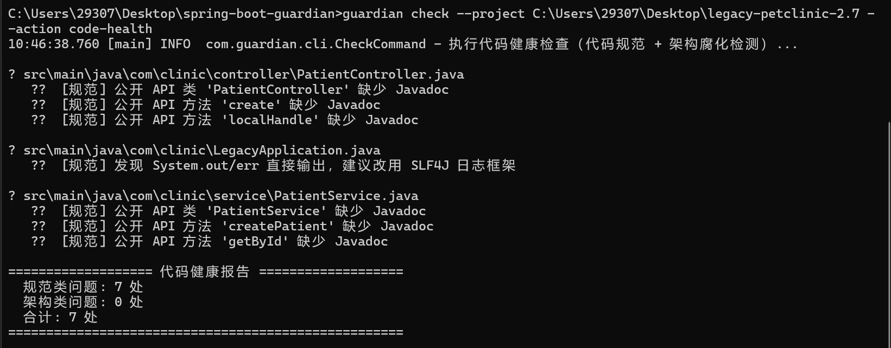
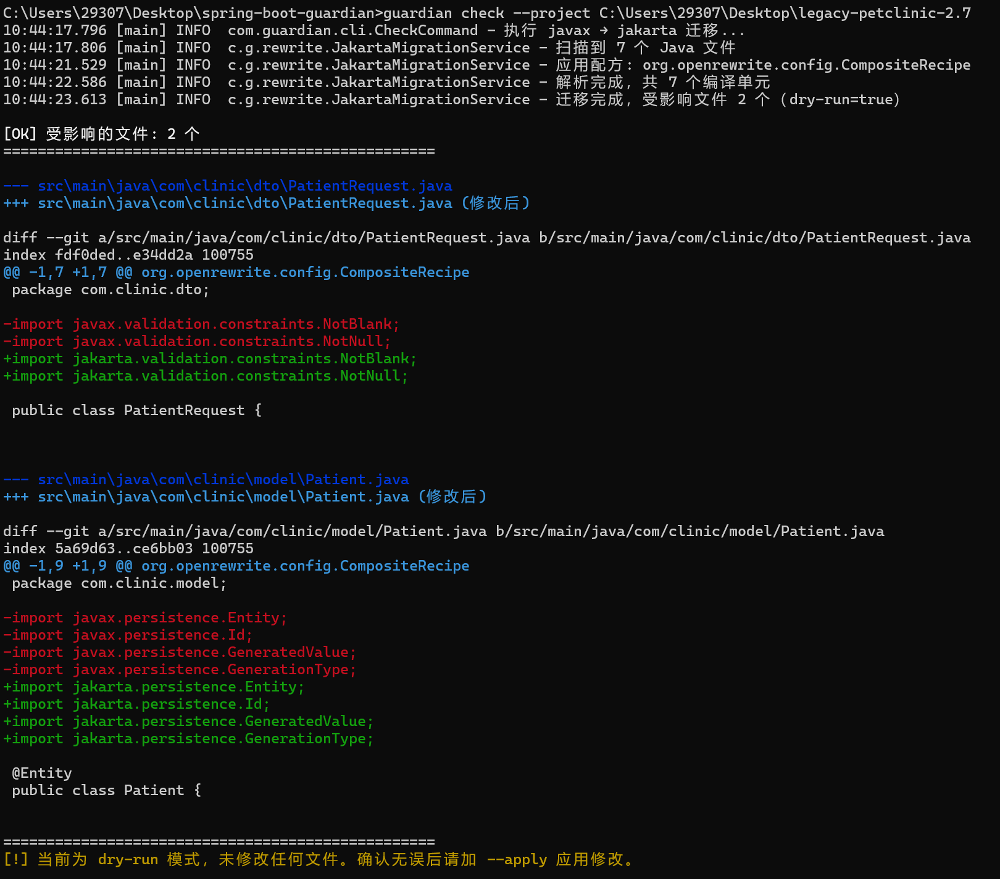
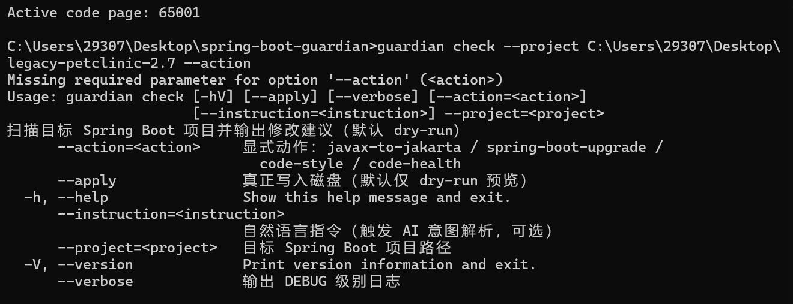

# Spring Boot Guardian

Spring Boot 项目专属医生：一个垂直领域的代码维护 CLI 工具。它把「自然语言意图解析」「确定性代码迁移」与「代码健康检测」三个能力结合在一条命令里——

- **AI 只做意图解析**（自然语言 → 结构化 JSON），绝不直接生成或修改源码；
- **所有代码修改由确定性工具 OpenRewrite 完成**，基于 AST Visitor 模式安全重构，只修改匹配节点，保留注释与格式，保证**可审计、可回滚、可测试**；
- **默认 dry-run**：只输出 Diff 预览，必须加 `--apply` 才会真正写入磁盘；
- **内置代码健康检查**：一键扫描代码规范与架构腐化问题，生成分类统计报告。

> 本项目本身是普通 Maven 项目，**不是** Web 应用，不引入 Spring Boot 依赖。

[](https://adoptium.net)
[](https://maven.apache.org)
[](#)
[](#)

---

## 特性

- **代码健康检查（`code-health`）**：聚合 12 条检测规则，覆盖**代码规范**（System.out/err 残留、空 catch 块、`printStackTrace`、日志使用不当、命名不规范、缺失 Javadoc、过期 TODO、配置硬编码密码）与**架构腐化**（分层违反、事务边界混乱、REST API 设计缺陷、SQL 字符串拼接），按类别输出统计报告；
- **javax → jakarta 迁移**：一键替换 Java EE 包名，适配 Spring Boot 3.x / Jakarta EE 9+；
- **Spring Boot 2.7 → 3.x 完整升级**：组合多个官方配方（Jakarta 迁移、Spring Security 6、JUnit 5、Boot 3 配置项）+ 自定义 `spring.factories → AutoConfiguration.imports` 迁移；
- **AI 意图解析**：用自然语言下达维护指令，DeepSeek 返回结构化 JSON 后自动调度对应配方，失败时优雅降级；
- **安全默认值**：全部操作默认 dry-run，只有显式 `--apply` 才写盘。

## 工作原理

```
自然语言指令 ──► DeepSeek 意图解析 ──► 结构化 JSON（意图/置信度/说明）
                                         │
                                         ▼
                    意图调度层（按意图选择 OpenRewrite Recipe）
                                         │
                                         ▼
                    确定性配方（AST 遍历 / 组合配方）
                                         │
                                         ▼
              dry-run：Diff 预览   /   --apply：写回磁盘
```

AI 只负责「听懂你说了什么」，源码如何修改由 OpenRewrite 确定性完成，杜绝 AI 直接改代码带来的不确定性。

## 运行截图


### 代码健康检查报告



### Jakarta 迁移 Diff 预览（dry-run）



### 帮助信息



## 前置要求

- JDK 17+（构建机已验证 JDK 21）
- Maven 3.8+

## 构建

```bash
mvn clean package -DskipTests
```

构建产物：

- `target/spring-boot-guardian-1.0.0-jar-with-dependencies.jar`（可执行 fat JAR，包含全部依赖）
- `target/spring-boot-guardian-1.0.0.jar`（精简 JAR）

## 快速开始

> 以下命令中的 `--project` 指向**目标 Spring Boot 项目**路径，`guardian` 是项目根目录下的包装脚本（另有 Windows 版 `guardian.bat`）。也可以直接用 `java -jar target/spring-boot-guardian-1.0.0-jar-with-dependencies.jar` 代替。

### 代码健康检查

```bash
./guardian check --project /path/to/spring-boot-app --action code-health
```

输出按**规范 / 架构**分组的检测结果与统计摘要：

```
📄 src/main/java/com/demo/web/UserControllerImpl.java
   ⚠️  [规范] 类名 'UserControllerImpl' 以 Impl 结尾，建议使用更具体的命名
   ⚠️  [规范] 公开 API 类 'UserControllerImpl' 缺少 Javadoc
   ⚠️  [架构] 接口 'listUsers' 返回 Map<String, Object>，建议定义 DTO
   ...

=================== 代码健康报告 ===================
  规范类问题: 9 处
  架构类问题: 5 处
  合计: 14 处
====================================================
```

单独运行代码规范检测（仅 System.out/err 等基础规则）：

```bash
./guardian check --project /path/to/spring-boot-app --action code-style
```

### Jakarta 迁移

```bash
./guardian check --project /path/to/spring-boot-app --action javax-to-jakarta
```

### Spring Boot 2.7 → 3.x 完整升级

```bash
./guardian check --project /path/to/spring-boot-app --action spring-boot-upgrade
```

### AI 模式（自然语言意图解析）

```bash
./guardian check --project /path/to/spring-boot-app --instruction "帮我把项目升级到 Spring Boot 3，把所有 javax 改成 jakarta"
```

> 若未配置 API Key 或 AI 调用失败，会自动**降级为无 AI 模式**（直接执行 Jakarta 迁移），不影响使用。

## 应用修改（重要！）

所有操作默认都是 **dry-run**，只输出 Diff 预览、不修改任何文件。确认无误后，在命令末尾追加 `--apply` 才会真正写入磁盘：

```bash
./guardian check --project /path/to/spring-boot-app --action spring-boot-upgrade --apply
```

## 命令选项

```
guardian check --project <路径> [--action <动作>] [--apply] [--instruction "指令"] [--verbose]
```

| 选项 | 说明 |
| --- | --- |
| `--project` | （必填）目标 Spring Boot 项目路径 |
| `--action` | 显式动作：`code-health` / `code-style` / `javax-to-jakarta` / `spring-boot-upgrade`；缺省时默认执行 Jakarta 迁移 |
| `--apply` | 真正写入磁盘；缺省为 dry-run |
| `--instruction` | 自然语言指令，触发 AI 意图解析（可选） |
| `--verbose` | 输出 DEBUG 级别日志 |

## 配置 DeepSeek API Key

AI 模式（`--instruction`）需要配置 API Key；无 AI 模式不需要任何配置。

- Linux / macOS / Git Bash：

  ```bash
  export DEEPSEEK_API_KEY=sk-xxxx
  export DEEPSEEK_MODEL=deepseek-chat   # 可选，默认 deepseek-chat
  ```

- Windows CMD：

  ```bat
  set DEEPSEEK_API_KEY=sk-xxxx
  set DEEPSEEK_MODEL=deepseek-chat
  ```

也可在项目目录下创建 `.guardian/config.yml`：

```yaml
deepseek.model: deepseek-chat
```

环境变量优先级高于配置文件。

## 项目结构

```
spring-boot-guardian/
├── pom.xml
├── .gitignore
├── guardian                      # Linux / macOS / Git Bash 包装脚本
├── guardian.bat                  # Windows 包装脚本
├── docs/screenshots/             # README 运行截图
├── src/main/java/com/guardian/
│   ├── GuardianApplication.java  # picocli 入口，定义顶级命令
│   ├── cli/CheckCommand.java     # check 子命令（意图解析 → 配方调度 → 输出）
│   ├── rewrite/JakartaMigrationService.java  # OpenRewrite 封装：javax→jakarta 迁移
│   ├── rewrite/SpringBootUpgradeService.java # 完整升级服务：组合官方 + 自定义配方
│   ├── rewrite/SourceFileResult.java         # 迁移结果 record
│   ├── rewrite/recipes/                      # 检测 / 迁移配方
│   │   ├── CodeHealthCompositeRecipe.java    # 代码健康检查组合配方（聚合全部检测规则）
│   │   ├── HealthFinding.java                # 自定义问题标记（支持同一位置多条问题）
│   │   ├── SystemOutInspection.java          # System.out/err 残留检测
│   │   ├── EmptyCatchInspection.java         # 空 catch 块检测
│   │   ├── PrintStackTraceInspection.java    # catch 中 printStackTrace 检测
│   │   ├── LoggingInspection.java            # 日志规范检测
│   │   ├── NamingConventionInspection.java   # 命名规范检测
│   │   ├── MissingJavadocInspection.java     # 公开 API 缺 Javadoc 检测
│   │   ├── TodoExpiredInspection.java        # 过期 TODO / FIXME 检测
│   │   ├── HardcodedPasswordInspection.java  # 配置文件硬编码密码检测
│   │   ├── LayeredArchitectureInspection.java# 分层架构违反检测
│   │   ├── TransactionBoundaryInspection.java# 事务边界检测
│   │   ├── ApiDesignInspection.java          # REST API 设计缺陷检测
│   │   ├── SqlConcatenationInspection.java   # SQL 拼接检测
│   │   └── SpringFactoriesMigration.java     # spring.factories → AutoConfiguration.imports
│   ├── ai/IntentParser.java      # DeepSeek 调用 + 严格 JSON 解析
│   ├── ai/Intent.java            # 结构化意图 record
│   ├── diff/DiffPrinter.java     # ANSI 彩色 Diff 打印
│   ├── diff/InspectionPrinter.java# 检测结果打印
│   ├── diff/HealthReportPrinter.java # 代码健康报告（分类统计）
│   └── config/GuardianConfig.java# 环境变量 + .guardian/config.yml 配置
├── src/main/resources/
│   ├── logback.xml
│   └── prompts/intent-system-prompt.txt  # 意图解析 System Prompt（强制严格 JSON）
├── src/test/java/com/guardian/   # 单元测试
└── README.md
```

## 设计要点

- **双输入路径**：显式动作（`--action`）直接调度配方（无 AI）；自然语言（`--instruction`）经 DeepSeek 意图分类返回 JSON 后再调度配方。
- **意图调度层**：根据结构化意图分发到对应 OpenRewrite Recipe，支持 `CODE_HEALTH`、`CODE_STYLE`、`JAKARTA_MIGRATION`、`SPRING_BOOT_UPGRADE`。
- **代码健康检查**：12 个检测 Recipe 通过 `CodeHealthCompositeRecipe` 聚合，一次运行全部规则；结果由 `HealthReportPrinter` 按规范 / 架构分类统计输出。
- **自定义问题标记**：OpenRewrite 的 `SearchResult` 在同一节点上只保留首个标记，为使同一位置能报告多条问题，实现了自定义 `HealthFinding` Marker。
- **完整升级（SPRING_BOOT_UPGRADE）**：`SpringBootUpgradeService` 将多个官方配方（Jakarta 迁移、Spring Security 6、JUnit 5、Boot 3 配置项）与自定义 `SpringFactoriesMigration` 打包为组合 Recipe 一键执行。
- **自定义迁移配方**：`SpringFactoriesMigration` 基于 `ScanningRecipe` 实现——扫描 `META-INF/spring.factories`、生成新的 `AutoConfiguration.imports` 文件、并移除/删除旧条目。
- **安全机制**：默认 dry-run；所有修改前必须在控制台展示 Diff；只有显式 `--apply` 才写盘。
- **技术栈**：Java 17+ / Maven / picocli / OpenRewrite 8.x / Jackson / SLF4J + Logback / 原生 Java HttpClient（未引入 Spring AI / LangChain4j）。

## 测试

```bash
mvn test
```

测试覆盖：意图解析、Diff 打印、代码健康组合配方、硬编码密码检测、System.out 检测、`spring.factories` 迁移等。

## 常见问题

**Q: `--instruction` 未配置 API Key 会怎样？**
A: 打印警告并降级为无 AI 模式（直接执行 Jakarta 迁移）。

**Q: AI 调用失败（网络、非 200、JSON 解析失败）？**
A: 同样优雅降级，不影响 dry-run 与 apply 流程。

**Q: 如何查看更详细的日志？**
A: 加 `--verbose` 开启 DEBUG 级别日志。

**Q: `code-health` 会修改代码吗？**
A: 不会。所有检测 Recipe 仅添加问题标记并输出报告，默认不写盘；只有迁移类动作加 `--apply` 才会修改文件。

## License

本项目目前未声明开源许可证。如需对外发布，请先在仓库根目录补充 `LICENSE` 文件（例如 MIT / Apache-2.0）并更新上方徽章。
